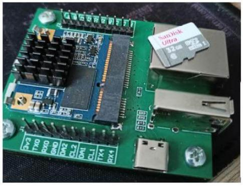
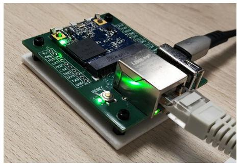
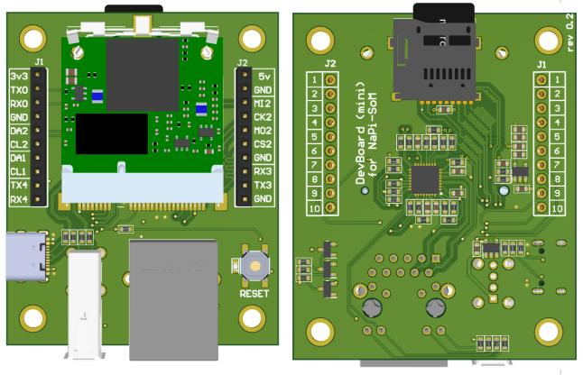
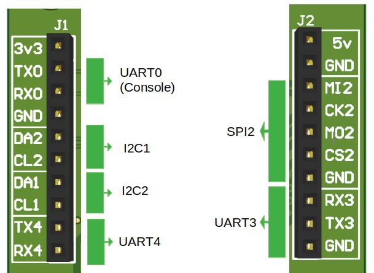

# NAPI-Slot — Compact SOM on RK3308

NAPIC is a compact single-board computer based on the **Rockchip RK3308** SoC,
optimized for audio processing, voice interfaces, and lightweight industrial I/O.

## Napi-Slot


## Napi-Slot software

All device tree sources, overlays, and software images are identical to Napi-C — see the [Napi-C](/napic/README.md) repository for details.


## Napi-Slot GPIO

>GPIO table in [PDF](/napi-slot/gpio/NapiSOM-rev02%20.pdf)


## Hardware Specifications

| Parameter        | Value                                  |
|------------------|----------------------------------------|
| SoC              | Rockchip RK3308 (4× Cortex-A35, 1.3 GHz) |
| RAM              | 512 MB DDR3                      |
| Storage          | 32Гб eMMC + microSD                |
| Ethernet         | 1× 100 Mbit                           |
| USB              | 1× USB 2.0 Host, 1× USB 2.0 OTG       |
| Audio            | I2S, PDM microphone array              |
| UART             | 4× UART                               |
| I2C              | 3× I2C                                |
| SPI              | 2× SPI                                |
| GPIO             | 26-pin header                          |
| OS               | Armbian (mainline), NapiLinux, OpenWRT            |


## Contents

```
napip/
├── dts/            # Base DTS (rk3308-napic.dts)
├── overlays/       # DT overlays for optional interfaces
├── gpio/           # 26-pin header pinout
├── armbian/        # Armbian userpatches
└── examples/       # Code and config examples
```

## Extra boards

Develop board 





### EXtra board pinout



