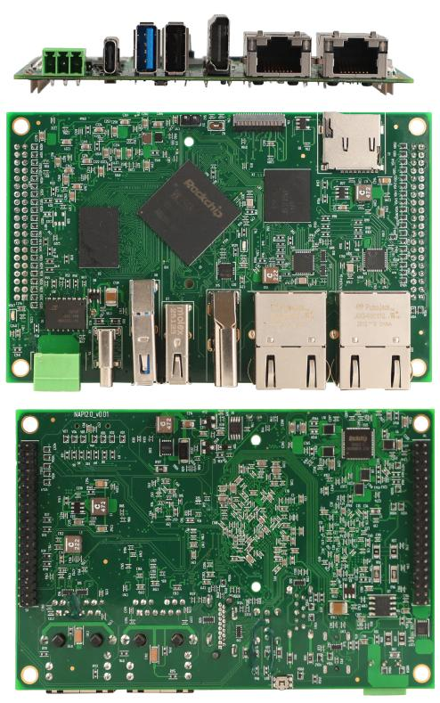
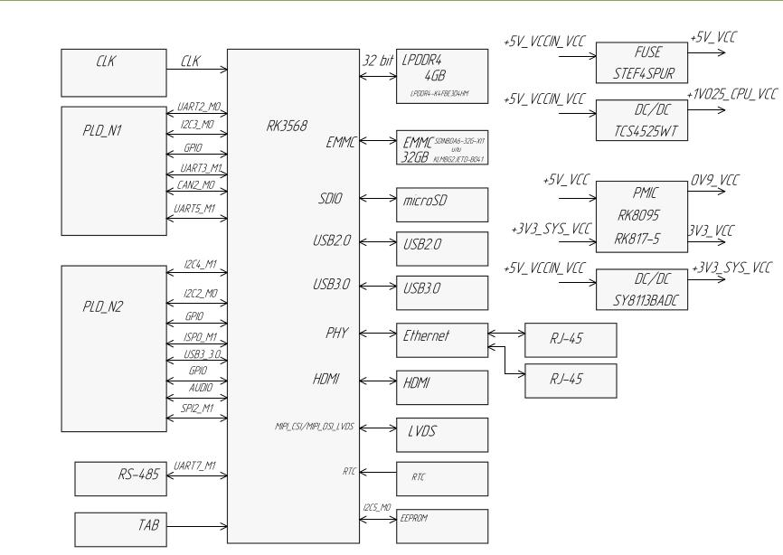
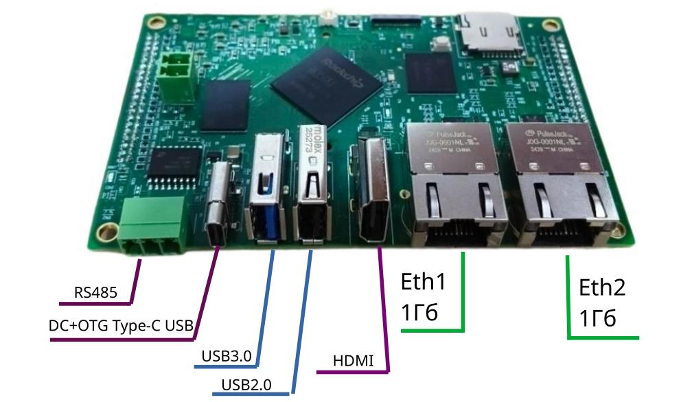

# NAPI2 — Industrial Single-Board Computer

> Based on Rockchip RK3568J with industrial temperature range

NAPI2 is a compact industrial SBC designed for:
- Industrial automation
- IoT gateways
- Data acquisition systems
- Embedded solutions
- Building industrial computers

**Board dimensions:** 109.4 × 70.2 mm



---

## Hardware Specifications



### Processor & Memory

| Parameter  | Value                                        |
|------------|----------------------------------------------|
| SoC        | Rockchip RK3568**J** (industrial temp range) |
| CPU        | 4× Cortex-A55 @ 2.0 GHz                     |
| RAM        | 4 GB LPDDR4                                  |
| Flash      | 32 GB eMMC                                   |
| Expandable | microSD slot                                 |

### Connectivity

| Interface  | Details                                      |
|------------|----------------------------------------------|
| Ethernet   | 2× Gigabit (all interfaces on front panel)   |
| USB        | USB 3.0, USB 2.0, USB Type-C (OTG / power)  |
| RS485      | Built-in (on-board, isolated)                |
| CAN        | CAN 2.0B                                     |
| SPI        | 2×                                           |
| I2C        | 2×                                           |
| UART       | 3× + UART2 (console)                         |




### Display

| Interface | Details                       |
|-----------|-------------------------------|
| HDMI      | HDMI output                   |
| LVDS      | For industrial display panels |

### GPIO Header

| Parameter | Value                                              |
|-----------|----------------------------------------------------|
| Connector | 2× GPIO headers, 2.0 mm pitch (mezzanine-friendly) |
| Power     | 5V (IN/OUT), 3.3V (OUT)                            |
| Signals   | 3× UART, CAN, 2× SPI, 2× I2C, USB 2.0            |


### On-Board Connectors

| Connector | Details           |
|-----------|-------------------|
| Power     | 5V DC input       |
| LVDS      | Display connector |
| RTC       | Battery (BAT)     |

---

## Key Advantages

- **All interfaces on the front panel** — no cable routing inside enclosures
- **RS485 built-in** — no external converter needed
- **Dual Gigabit Ethernet** — suitable for gateway and routing applications
- **Compact form factor** — 109.4 × 70.2 mm
- **2.0 mm pitch GPIO** — easy integration into mezzanine carrier boards
- **LVDS output** — direct connection to industrial display panels
- **Industrial SoC variant** — RK3568**J** with extended temperature range

---

## Software

### Armbian Images

| Kernel         | Download                                                             |
|----------------|----------------------------------------------------------------------|
| Vendor (6.1)   | https://download.napilinux.ru/linuximg/napi2/armbian-ditrib/vendor  |
| Current (6.12) | https://download.napilinux.ru/linuximg/napi2/armbian-ditrib/current |

> **Vendor kernel is recommended** for production use — includes hardware video decode (MPP/VA-API via `/dev/mpp_service`).  
> **Current (mainline) kernel** is preferred for upstream compatibility and active development.

### NapiLinux

Custom OS with web interface: https://download.napilinux.ru/napilinux/0.2.6.1/napilinux-napi-2-dev/

---

## NapiConfig 2.0 — Web Interface

NAPI2 running **NapiLinux** includes **NapiConfig 2.0** — a lightweight web UI available on port 443, built on Vue + FastAPI. No SSH required for routine configuration:

- Ethernet interface management
- Modbus sensor management — add, edit, test on the fly, load from repository
- Sensor register graphs with scale and interval controls
- **Modbus RTU → Modbus TCP gateway** — configure from browser
- Linux service management with log viewer
- **Web SSH terminal** — full terminal in the browser
- Date/time settings, full system reset

→ https://napilinux.ru/napiconfig2/

---

## Expansion Boards

### Prototyping / Debug Board

Adapter board for development:
- Wide-range power input: **9–36V**
- Serial console connector
- GPIO adapter: 2.0 mm → 2.54 mm pitch breakout

### FCU3568 Power & I/O Board

Industrial carrier board for NAPI2 with extended power and SCADA/ICS I/O.

---

## This Repository

```
napi2/
├── dts/        # Base device tree (rk3568-napi2.dts)
├── overlays/   # DT overlays: RS485, CAN, LVDS, I2C, SPI, PWM
├── gpio/       # 40-pin header pinout (CSV + diagram)
└── examples/   # RS485 Modbus, CAN SocketCAN, GPIO, I2C
```

## Quick Start

Flash a ready-made image and boot:

```bash
# Download image
wget https://download.napilinux.ru/linuximg/napi2/armbian-ditrib/vendor

# Flash to SD card
dd if=Armbian_*.img of=/dev/sdX bs=4M status=progress && sync

# Enable overlays after first boot — edit /boot/armbianEnv.txt:
# overlays=rk3568-napi2-rs485-uart3 rk3568-napi2-can0
```

## Building Armbian Image

To build a custom image from source, see:
👉 **[napi-armbian-build](https://github.com/your-org/napi-armbian-build)** — kernel patches, overlays, build scripts and utilities for NAPI2 and NAPI-C.

---

## Ordering & Contact

To order NAPI2 boards or custom carrier boards, or to discuss
integration into your project — feel free to reach out:

📧 dj.novikov@gmail.com

---

## Links

- [Official product page](https://napiworld.ru/docs/napi2/)
- [GPIO Pinout](./gpio/README.md)
- [Overlays](./overlays/README.md)
- [NAPIC vs NAPI2 Comparison](../docs/comparison.md)
- [napi-armbian-build](https://github.com/your-org/napi-armbian-build)
- [GPIO map PDF](https://napiworld.ru/assets/files/napi2-gpio10-fb68ec697eca30ab520f1465ce863d20.pdf)
- [Assembly drawing PDF](https://napiworld.ru/assets/files/Сборочный_чертеж_NAPI_2_ТФПМ_469535_100_СБ-19fb1c332cdfa2c4b6d57f2539f734c0.PDF)